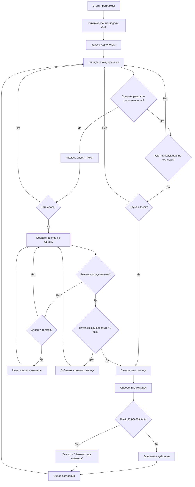

# Vosk Assistant
Скрипт для распознавания голосовых команд на русском языке с использованием [Vosk](https://alphacephei.com/vosk/) и выполнением действий после произнесения триггерного слова.

### Зависимости
Необходимые библиотеки:
```[bash]
pip install vosk sounddevice pyautogui pillow
```
Также потребуется модель Vosk [vosk-model-small-ru-0.22](https://alphacephei.com/vosk/models/vosk-model-small-ru-0.22.zip)

### Запуск

```[bash]
python triggerNew.py
```
#### Дополнительные парметры

|Параметр|Описание|
|--------|--------|
|`-l`,`--list-devices`|Показать список доступных аудиоустройств и завершиться|
|`-d`,`--device`|Указать устройство ввода|
|`-r`,`--samplerate`|Частота дискретизации записываемого аудио|
|`-t`,`--trigger`|Слово-триггер|

### Поддерживаемые команды

|Команда|Действие|
|--------|--------|
|`сверни все окна`|Сворачивает все окна|
|`сделай скриншот`|Создает скриншот и сохраняет его как `screenshot.png`|
|`создай файл <имя>`|Создает пустой файл `имя.txt`|
|`открой браузер`|Открывает новое окно с Google в браузере по умолчанию|
|`напиши <текст>`|Выводит текст в консоль|
|`найди <запрос>`|Посик в Google|

### Как работает
1. Скрипт постоянно слушает микрофон
2. После обнаружения слова-триггера начинается запись команды
3. Команда завершается при паузе(~2 секунды)
4. Выполняется наиболее похожая команда


