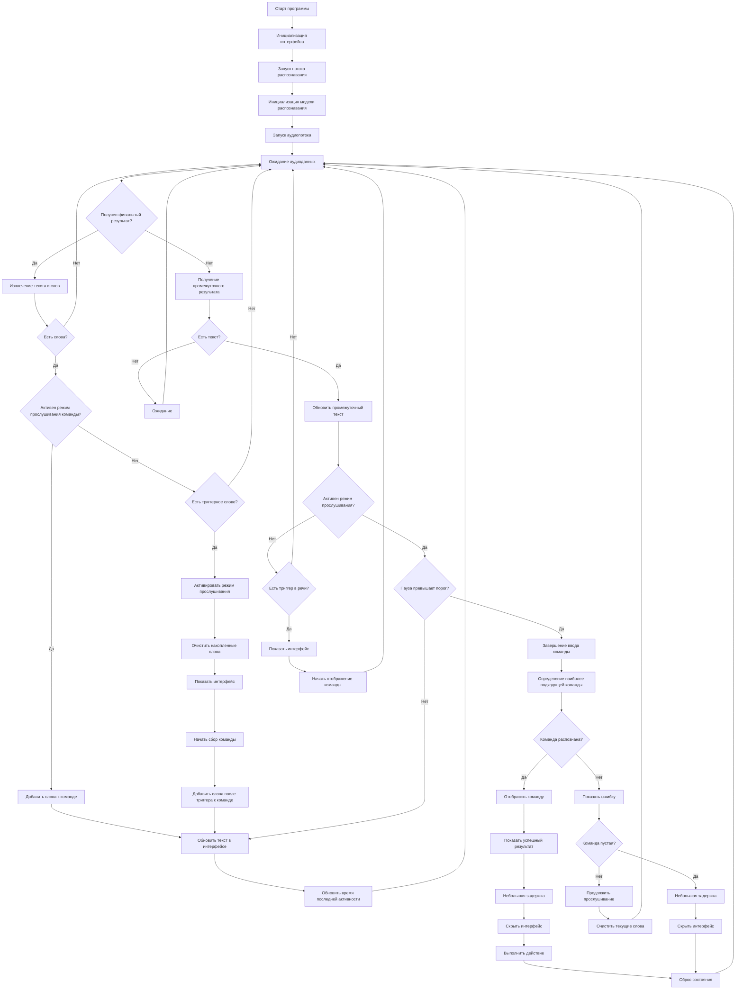

# Vosk Assistant

Скрипт для распознавания голосовых команд на русском языке с использованием [Vosk](https://alphacephei.com/vosk/) и выполнением действий после произнесения триггерного слова.

### Зависимости

```[bash]
vosk sounddevice pyautogui pillow PyQt5
```
Для распознавания испоьзуется модель [vosk-model-small-ru-0.22](https://alphacephei.com/vosk/models/vosk-model-small-ru-0.22.zip)

В случае ошибки `OSError: PortAudio library not found`:

```[bash]
sudo apt install libportaudio2
```
**Примечание**: код тестировался на Python==3.13.3 и 3.12.3

### Установка и запуск

Скачайте или клонируйте репозиторий

```[bash]
git clone https://github.com/M1erOw/voskAssistent.git
```

* #### Для Linux:

    - Cделайте скрипт исполняемым `chmod +x run.sh`

    - `./run.sh`
* #### Для Windows:

    - `run.bat`

### Поддерживаемые команды

|Команда|Действие|
|--------|--------|
|`сверни все окна`|Показать/скрыть рабочий стол|
|`сделай скриншот`|Создает скриншот и сохраняет его как `screenshot.png`|
|`создай файл <имя>`|Создает пустой файл `имя.txt`|
|`открой браузер`|Открывает новое окно с Google в браузере по умолчанию|
|`напиши <текст>`|Выводит текст в консоль|
|`найди <запрос>`|Поиск в Google|
|`запиши в файл <псевдоним> <текст>`|Записать в файл|
|`создай напоминание <время> <текст>`|Таймер|
|`создай псевдоним`|Добавить псевдоним|
|`запусти приложение <псевдоним>`|Запуск программы|
|`останови приложение <псевдоним>`|Завершение программы|
|`сделай громче`|Увеличить звук|
|`сделай тише`|Уменьшить звук|
|`установи громкость <число>`|Установить громкость|
|`включи звук`|Включить звук|
|`выключи звук`|Выключить звук|
|`запусти <псевдоним>`|Открыть ссылку|

### Как работает
1. Скрипт постоянно слушает микрофон
2. После обнаружения слова-триггера начинается запись команды
3. Команда завершается при паузе(~2 секунды)
4. Выполняется наиболее похожая команда

